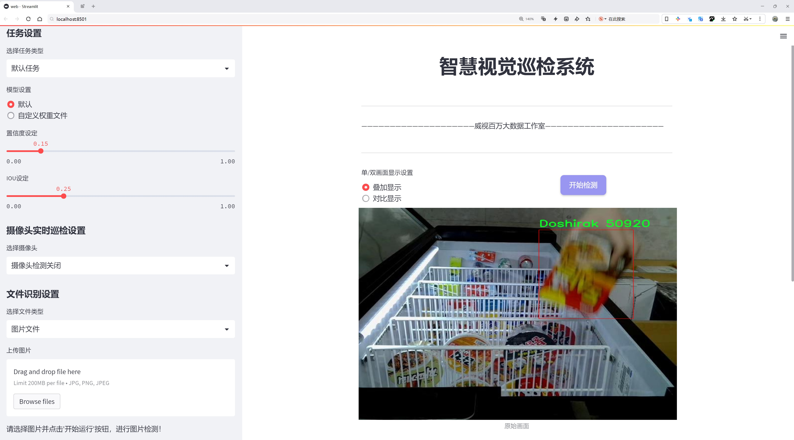
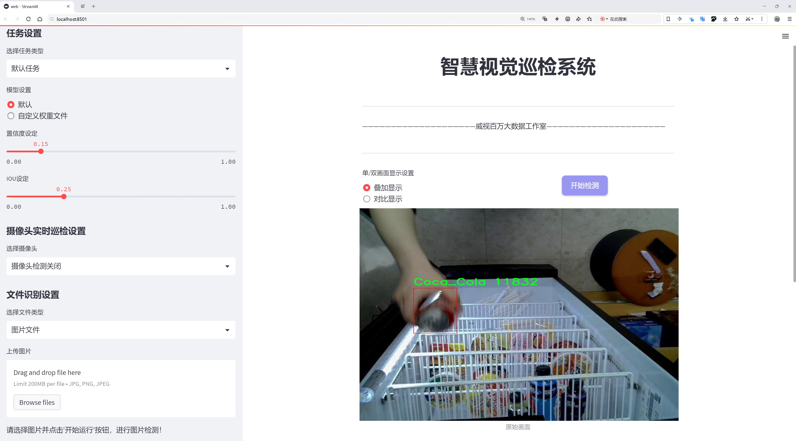
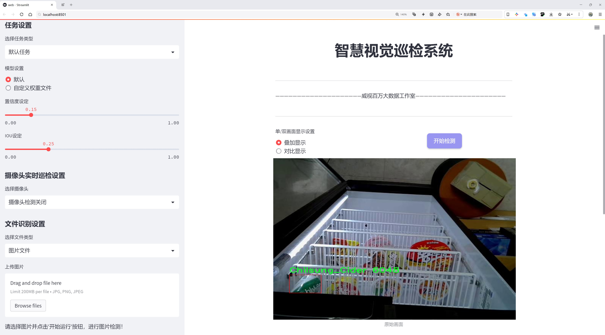
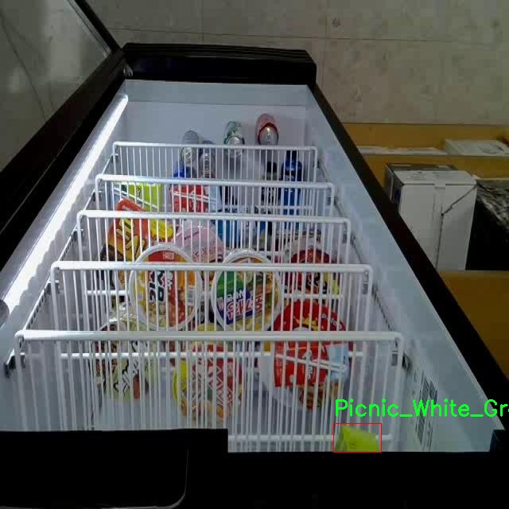
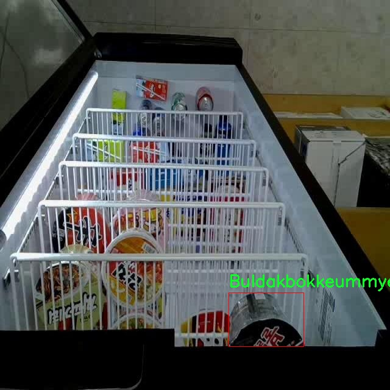
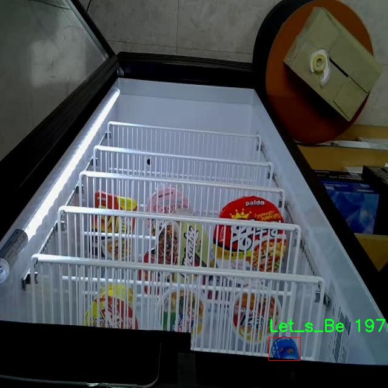
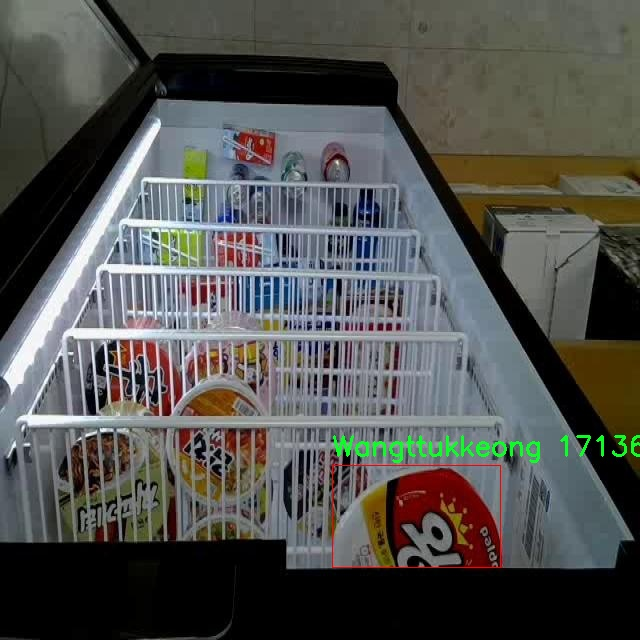

# 食品包装识别检测系统源码分享
 # [一条龙教学YOLOV8标注好的数据集一键训练_70+全套改进创新点发刊_Web前端展示]

### 1.研究背景与意义

项目参考[AAAI Association for the Advancement of Artificial Intelligence](https://gitee.com/qunshansj/projects)

项目来源[AACV Association for the Advancement of Computer Vision](https://gitee.com/qunmasj/projects)

研究背景与意义

随着全球经济的快速发展和生活水平的提高，食品消费市场日益繁荣，食品包装的多样性和复杂性也随之增加。食品包装不仅是保护食品的物理屏障，更是传递品牌形象和消费者信息的重要载体。在这一背景下，食品包装的识别与分类显得尤为重要。传统的人工识别方法不仅效率低下，而且容易受到人为因素的影响，难以满足现代化生产和销售的需求。因此，开发一种高效、准确的食品包装识别系统，成为了行业亟待解决的问题。

近年来，深度学习技术的迅猛发展为计算机视觉领域带来了革命性的变化，尤其是在目标检测方面。YOLO（You Only Look Once）系列模型因其实时性和高准确率而广泛应用于各类物体检测任务。YOLOv8作为该系列的最新版本，结合了更为先进的网络结构和训练策略，具有更强的特征提取能力和更快的推理速度。然而，尽管YOLOv8在许多应用场景中表现出色，但在特定领域，如食品包装识别，仍然存在一些挑战。例如，食品包装的外观多样性、光照变化、背景复杂性等因素，可能导致模型的识别准确率下降。因此，基于改进YOLOv8的食品包装识别系统的研究，具有重要的理论和实际意义。

本研究所使用的数据集包含3961张图像，涵盖21个类别的食品包装，包括知名品牌如“可口可乐”、“七星汽水”等。这些数据不仅丰富了模型的训练样本，也为其在实际应用中的推广提供了坚实的基础。通过对这些数据的深入分析和处理，可以有效提升模型对不同类型食品包装的识别能力，进而实现更高的准确率和更快的识别速度。此外，针对特定类别的食品包装，研究者可以根据实际需求进行模型的微调和优化，以满足不同场景下的应用需求。

在食品安全日益受到重视的今天，食品包装的识别系统不仅能够帮助企业提高生产效率，降低人工成本，还能在一定程度上保障消费者的权益。通过自动化的识别系统，企业可以实时监控产品的包装情况，及时发现和纠正潜在的包装问题，确保产品质量。同时，该系统也可以为消费者提供更为直观的信息，帮助他们做出更为明智的购买决策。

综上所述，基于改进YOLOv8的食品包装识别系统的研究，不仅具有重要的学术价值，还有助于推动食品行业的智能化发展。通过提升食品包装的识别效率和准确性，能够为企业带来显著的经济效益，同时也为消费者提供更为安全、便捷的购物体验。因此，本研究的开展，具有深远的社会意义和广阔的应用前景。

### 2.图片演示







##### 注意：由于此博客编辑较早，上面“2.图片演示”和“3.视频演示”展示的系统图片或者视频可能为老版本，新版本在老版本的基础上升级如下：（实际效果以升级的新版本为准）

  （1）适配了YOLOV8的“目标检测”模型和“实例分割”模型，通过加载相应的权重（.pt）文件即可自适应加载模型。

  （2）支持“图片识别”、“视频识别”、“摄像头实时识别”三种识别模式。

  （3）支持“图片识别”、“视频识别”、“摄像头实时识别”三种识别结果保存导出，解决手动导出（容易卡顿出现爆内存）存在的问题，识别完自动保存结果并导出到tempDir中。

  （4）支持Web前端系统中的标题、背景图等自定义修改，后面提供修改教程。

  另外本项目提供训练的数据集和训练教程,暂不提供权重文件（best.pt）,需要您按照教程进行训练后实现图片演示和Web前端界面演示的效果。

### 3.视频演示

[3.1 视频演示](https://www.bilibili.com/video/BV1kZ4deRE4f/)

### 4.数据集信息展示

##### 4.1 本项目数据集详细数据（类别数＆类别名）

nc: 21
names: ['Buldakbokkeummyeon_Keunkeop', 'Carbo_Buldakbokkeummyeon_Keunkeop', 'Chilsung_Cider', 'Coca_Cola', 'Doshirak', 'Jinlamyeon_Maeunmat', 'Jjapageti_Keunsabalmyeon', 'Kimchi_Sabalmyeon', 'Let_s_Be', 'MoGu_MoGU', 'Narangd_Cider', 'Neoguri_Keunsabalmyeon', 'POCARI_SWEAT', 'POWER_ADE_MEGA_BOLTZ', 'POWER_ADE_MOUNTAIN_BLAST', 'POWER_ADE_PURPLE_STORM', 'Picnic_Apple', 'Picnic_White_Grape', 'Sinlamyeon_Keunsabalmyeon', 'Wangttukkeong', 'Yukgaejang_Sabalmyeon']


##### 4.2 本项目数据集信息介绍

数据集信息展示

在本研究中，我们使用了名为“fidge”的数据集，以训练和改进YOLOv8模型在食品包装识别系统中的表现。该数据集专门设计用于识别和分类多种食品包装，具有21个不同的类别，涵盖了广泛的食品和饮料产品。这些类别不仅反映了市场上常见的商品，还展示了不同品牌和类型的多样性，为模型的训练提供了丰富的样本。

具体而言，数据集中包含的类别包括：Buldakbokkeummyeon_Keunkeop、Carbo_Buldakbokkeummyeon_Keunkeop、Chilsung_Cider、Coca_Cola、Doshirak、Jinlamyeon_Maeunmat、Jjapageti_Keunsabalmyeon、Kimchi_Sabalmyeon、Let_s_Be、MoGu_MoGU、Narangd_Cider、Neoguri_Keunsabalmyeon、POCARI_SWEAT、POWER_ADE_MEGA_BOLTZ、POWER_ADE_MOUNTAIN_BLAST、POWER_ADE_PURPLE_STORM、Picnic_Apple、Picnic_White_Grape、Sinlamyeon_Keunsabalmyeon、Wangttukkeong以及Yukgaejang_Sabalmyeon。这些类别涵盖了从方便面、饮料到即食餐等多种食品类型，能够有效地反映出消费者日常生活中常见的选择。

数据集的设计考虑到了多样性和代表性，使得模型在实际应用中能够具备更强的识别能力。例如，方便面类的产品如Buldakbokkeummyeon和Jjapageti，具有不同的包装设计和色彩，这对模型的视觉识别能力提出了挑战。而饮料类的产品如Chilsung_Cider和Coca_Cola，则通过其独特的瓶身和标签设计，使得模型在识别时需要关注更多的细节特征。

此外，数据集中的每个类别都经过精心标注，确保在训练过程中，模型能够学习到每种食品包装的独特特征。这种精确的标注不仅提高了模型的训练效率，也增强了其在实际应用中的准确性。通过对“fidge”数据集的充分利用，我们期望能够显著提升YOLOv8在食品包装识别任务中的性能，使其在多种环境下都能保持高效的识别能力。

在未来的研究中，我们还计划对数据集进行扩展，增加更多的食品包装类别，以进一步提升模型的泛化能力和适应性。通过不断丰富数据集，我们希望能够应对市场上日益变化的食品包装设计，确保模型在实际应用中的持续有效性和可靠性。总之，“fidge”数据集为我们的研究提供了坚实的基础，使得我们能够在食品包装识别领域取得更大的进展。










### 5.全套项目环境部署视频教程（零基础手把手教学）

[5.1 环境部署教程链接（零基础手把手教学）](https://www.ixigua.com/7404473917358506534?logTag=c807d0cbc21c0ef59de5)


[5.2 安装Python虚拟环境创建和依赖库安装视频教程链接（零基础手把手教学）](https://www.ixigua.com/7404474678003106304?logTag=1f1041108cd1f708b01a)

### 6.手把手YOLOV8训练视频教程（零基础小白有手就能学会）

[6.1 手把手YOLOV8训练视频教程（零基础小白有手就能学会）](https://www.ixigua.com/7404477157818401292?logTag=d31a2dfd1983c9668658)

### 7.70+种全套YOLOV8创新点代码加载调参视频教程（一键加载写好的改进模型的配置文件）

[7.1 70+种全套YOLOV8创新点代码加载调参视频教程（一键加载写好的改进模型的配置文件）](https://www.ixigua.com/7404478314661806627?logTag=29066f8288e3f4eea3a4)

### 8.70+种全套YOLOV8创新点原理讲解（非科班也可以轻松写刊发刊，V10版本正在科研待更新）

由于篇幅限制，每个创新点的具体原理讲解就不一一展开，具体见下列网址中的创新点对应子项目的技术原理博客网址【Blog】：


[8.1 70+种全套YOLOV8创新点原理讲解链接](https://gitee.com/qunmasj/good)

### 9.系统功能展示（检测对象为举例，实际内容以本项目数据集为准）

图9.1.系统支持检测结果表格显示

  图9.2.系统支持置信度和IOU阈值手动调节

  图9.3.系统支持自定义加载权重文件best.pt(需要你通过步骤5中训练获得)

  图9.4.系统支持摄像头实时识别

  图9.5.系统支持图片识别

  图9.6.系统支持视频识别

  图9.7.系统支持识别结果文件自动保存

  图9.8.系统支持Excel导出检测结果数据


### 10.原始YOLOV8算法原理

原始YOLOv8算法原理

YOLOv8作为YOLO系列的最新版本，标志着目标检测技术的一次重要飞跃。与其前身YOLOv5相比，YOLOv8在检测精度和速度上都取得了显著的提升，充分展示了深度学习在计算机视觉领域的强大潜力。YOLOv8的设计理念是通过优化网络结构和算法流程，提升模型的实时性和准确性，以适应日益复杂的应用场景。

YOLOv8的网络结构可以分为四个主要部分：输入端、骨干网络、颈部网络和头部网络。输入端的设计旨在对输入图像进行有效的预处理，以便为后续的特征提取打下良好的基础。该部分包括马赛克数据增强、自适应锚框计算和自适应灰度填充等技术，旨在提升模型对不同场景和光照条件的适应能力。马赛克增强通过将多张图像拼接在一起，增加了训练数据的多样性，从而提升了模型的泛化能力。

骨干网络是YOLOv8的核心组成部分，采用了C2f结构替代了YOLOv5中的C3结构。C2f模块通过引入更多的分支和跨层连接，增强了模型的梯度流动性，使得特征学习更加高效。结合SPPF（Spatial Pyramid Pooling Fusion）模块，YOLOv8能够有效地处理不同尺度的特征图，从而提高了对多尺度目标的检测能力。SPPF模块通过不同尺寸的池化操作，融合了来自不同层次的特征信息，进一步丰富了网络的特征表示能力。

颈部网络采用了路径聚合网络（PAN）结构，这一设计旨在加强不同尺度特征的融合能力。PAN通过特征金字塔和路径聚合的结合，促进了语义信息和定位信息的有效转移，使得YOLOv8在处理不同大小目标时表现得更加出色。这样的设计不仅提升了特征融合的效果，还增强了模型对复杂场景的适应能力，尤其是在存在多个目标的情况下。

头部网络是YOLOv8的最后一部分，其设计上实现了分类和检测过程的解耦。传统的YOLO系列通常将分类和回归任务耦合在一起，而YOLOv8则采用了解耦头结构，将这两个任务分开处理。这样的设计使得模型在进行目标检测时，能够更加专注于各自的任务，减少了任务间的干扰，从而提升了检测精度。头部网络中，YOLOv8引入了Task-Aligned Assigner策略，以更有效地分配正负样本，并结合了二元交叉熵损失和分布焦点损失等多种损失函数，进一步优化了模型的训练过程。

值得一提的是，YOLOv8采用了无锚框（Anchor-Free）检测方法，这一创新性设计使得模型不再依赖于预定义的锚框，从而简化了目标检测的过程。传统的锚框方法在处理不同尺度和形状的目标时，往往需要进行繁琐的锚框选择和调整，而YOLOv8通过直接回归目标的位置和大小，能够更快速地聚焦于目标区域。这种方法不仅提高了检测速度，还增强了模型对各种目标的适应能力，使得YOLOv8在实时检测任务中表现得尤为出色。

在整体性能上，YOLOv8通过精简模型结构和优化网络参数，达到了轻量化的效果，使得其能够在嵌入式设备上高效运行。这一特性使得YOLOv8不仅适用于传统的计算机视觉任务，还能够广泛应用于智能监控、自动驾驶、无人机等领域，满足了实时检测的需求。

综上所述，YOLOv8通过对网络结构的深度优化和算法流程的创新，展现了其在目标检测领域的强大能力。其独特的设计理念和高效的实现方式，使得YOLOv8成为了当前目标检测技术中的佼佼者。无论是在精度、速度还是适应性方面，YOLOv8都为后续的研究和应用提供了新的思路和方向，推动了计算机视觉技术的不断进步。


### 11.项目核心源码讲解（再也不用担心看不懂代码逻辑）

#### 11.1 code\ultralytics\nn\modules\utils.py

以下是对给定代码的核心部分进行分析和详细注释的结果：

```python
# Ultralytics YOLO 🚀, AGPL-3.0 license
"""模块 utils."""

import copy
import math
import numpy as np
import torch
import torch.nn as nn
import torch.nn.functional as F
from torch.nn.init import uniform_

__all__ = "multi_scale_deformable_attn_pytorch", "inverse_sigmoid"

def inverse_sigmoid(x, eps=1e-5):
    """计算张量的反 sigmoid 函数。

    参数:
        x (torch.Tensor): 输入张量，值应在 [0, 1] 范围内。
        eps (float): 防止除零的最小值。

    返回:
        torch.Tensor: 反 sigmoid 计算结果。
    """
    # 限制 x 的值在 0 到 1 之间
    x = x.clamp(min=0, max=1)
    # 防止计算时出现零
    x1 = x.clamp(min=eps)
    x2 = (1 - x).clamp(min=eps)
    # 计算反 sigmoid
    return torch.log(x1 / x2)

def multi_scale_deformable_attn_pytorch(
    value: torch.Tensor,
    value_spatial_shapes: torch.Tensor,
    sampling_locations: torch.Tensor,
    attention_weights: torch.Tensor,
) -> torch.Tensor:
    """
    多尺度可变形注意力机制。

    参数:
        value (torch.Tensor): 输入特征，形状为 (bs, C, num_heads, embed_dims)。
        value_spatial_shapes (torch.Tensor): 特征图的空间形状。
        sampling_locations (torch.Tensor): 采样位置，形状为 (bs, num_queries, num_heads, num_levels, num_points, 2)。
        attention_weights (torch.Tensor): 注意力权重，形状为 (bs, num_heads, num_queries, num_levels, num_points)。

    返回:
        torch.Tensor: 输出特征，形状为 (bs, num_queries, num_heads * embed_dims)。
    """
    # 获取输入的维度信息
    bs, _, num_heads, embed_dims = value.shape
    _, num_queries, _, num_levels, num_points, _ = sampling_locations.shape

    # 将输入特征根据空间形状分割成多个特征图
    value_list = value.split([H_ * W_ for H_, W_ in value_spatial_shapes], dim=1)
    # 将采样位置映射到 [-1, 1] 范围
    sampling_grids = 2 * sampling_locations - 1
    sampling_value_list = []

    # 遍历每个尺度的特征图
    for level, (H_, W_) in enumerate(value_spatial_shapes):
        # 处理当前尺度的特征图
        value_l_ = value_list[level].flatten(2).transpose(1, 2).reshape(bs * num_heads, embed_dims, H_, W_)
        # 获取当前尺度的采样网格
        sampling_grid_l_ = sampling_grids[:, :, :, level].transpose(1, 2).flatten(0, 1)
        # 使用双线性插值从特征图中采样
        sampling_value_l_ = F.grid_sample(
            value_l_, sampling_grid_l_, mode="bilinear", padding_mode="zeros", align_corners=False
        )
        sampling_value_list.append(sampling_value_l_)

    # 处理注意力权重的形状
    attention_weights = attention_weights.transpose(1, 2).reshape(
        bs * num_heads, 1, num_queries, num_levels * num_points
    )
    
    # 计算最终输出
    output = (
        (torch.stack(sampling_value_list, dim=-2).flatten(-2) * attention_weights)
        .sum(-1)
        .view(bs, num_heads * embed_dims, num_queries)
    )
    
    return output.transpose(1, 2).contiguous()
```

### 代码分析与注释
1. **反 sigmoid 函数** (`inverse_sigmoid`):
   - 该函数用于计算输入张量的反 sigmoid 值，确保输入值在 [0, 1] 范围内，并通过 `eps` 参数避免除零错误。

2. **多尺度可变形注意力机制** (`multi_scale_deformable_attn_pytorch`):
   - 该函数实现了多尺度的可变形注意力机制，适用于特征图的采样和加权。
   - 输入包括特征值、特征图的空间形状、采样位置和注意力权重。
   - 通过双线性插值从不同尺度的特征图中采样，并根据注意力权重加权这些采样值，最终输出合并后的特征。

### 总结
以上代码实现了反 sigmoid 函数和多尺度可变形注意力机制的核心功能，适用于深度学习模型中的特征处理和注意力机制。通过详细的注释，便于理解每个函数的输入、输出及其功能。

这个文件是Ultralytics YOLO项目中的一个工具模块，主要用于定义一些深度学习模型中常用的函数和操作。代码中包含了多个功能函数，下面对这些函数逐一进行说明。

首先，文件导入了一些必要的库，包括`copy`、`math`、`numpy`和`torch`等，这些库提供了深度学习所需的基本功能和数学运算支持。

接下来，定义了一个名为`_get_clones`的函数。这个函数接收一个模块和一个整数n作为参数，返回一个包含n个深度复制模块的列表。这在构建模型时非常有用，尤其是在需要多个相同层的情况下。

然后是`bias_init_with_prob`函数，它用于根据给定的先验概率初始化卷积或全连接层的偏置值。这个函数的实现通过计算给定概率的对数几率来返回偏置的初始值。

`linear_init`函数用于初始化线性模块的权重和偏置。它根据模块的权重形状计算一个边界值，并使用均匀分布初始化权重和偏置。这有助于在训练开始时提供一个合理的参数初始化。

`inverse_sigmoid`函数计算输入张量的反sigmoid函数。它首先将输入限制在0到1之间，然后计算反sigmoid值，避免了数值不稳定的问题。

最后，`multi_scale_deformable_attn_pytorch`函数实现了多尺度可变形注意力机制。这个函数的输入包括值张量、空间形状、采样位置和注意力权重。它首先对输入的值进行分割，并计算采样网格。接着，函数通过`F.grid_sample`方法在不同的尺度上对值进行采样，得到不同层次的特征。最后，函数将采样得到的特征与注意力权重结合，输出最终的注意力结果。

整体来看，这个文件提供了一些深度学习模型中常用的工具函数，尤其是在实现复杂的注意力机制时，这些函数可以帮助简化代码并提高可读性。

#### 11.2 70+种YOLOv8算法改进源码大全和调试加载训练教程（非必要）\ultralytics\nn\backbone\SwinTransformer.py

以下是经过简化和注释的核心代码部分，主要包括Swin Transformer的结构和功能模块。

```python
import torch
import torch.nn as nn
import torch.nn.functional as F
import numpy as np

class Mlp(nn.Module):
    """ 多层感知机 (MLP) 模块 """

    def __init__(self, in_features, hidden_features=None, out_features=None, act_layer=nn.GELU, drop=0.):
        super().__init__()
        out_features = out_features or in_features  # 输出特征数
        hidden_features = hidden_features or in_features  # 隐藏层特征数
        self.fc1 = nn.Linear(in_features, hidden_features)  # 第一层线性变换
        self.act = act_layer()  # 激活函数
        self.fc2 = nn.Linear(hidden_features, out_features)  # 第二层线性变换
        self.drop = nn.Dropout(drop)  # Dropout层

    def forward(self, x):
        """ 前向传播 """
        x = self.fc1(x)  # 线性变换
        x = self.act(x)  # 激活
        x = self.drop(x)  # Dropout
        x = self.fc2(x)  # 线性变换
        x = self.drop(x)  # Dropout
        return x


class WindowAttention(nn.Module):
    """ 窗口注意力机制模块 """

    def __init__(self, dim, window_size, num_heads, qkv_bias=True, attn_drop=0., proj_drop=0.):
        super().__init__()
        self.dim = dim  # 输入通道数
        self.window_size = window_size  # 窗口大小
        self.num_heads = num_heads  # 注意力头数
        head_dim = dim // num_heads  # 每个头的维度
        self.scale = head_dim ** -0.5  # 缩放因子

        # 定义相对位置偏置参数
        self.relative_position_bias_table = nn.Parameter(
            torch.zeros((2 * window_size[0] - 1) * (2 * window_size[1] - 1), num_heads))

        # 计算相对位置索引
        coords_h = torch.arange(self.window_size[0])
        coords_w = torch.arange(self.window_size[1])
        coords = torch.stack(torch.meshgrid([coords_h, coords_w]))  # 生成坐标网格
        coords_flatten = torch.flatten(coords, 1)  # 展平坐标
        relative_coords = coords_flatten[:, :, None] - coords_flatten[:, None, :]  # 计算相对坐标
        relative_coords = relative_coords.permute(1, 2, 0).contiguous()  # 调整维度
        relative_coords[:, :, 0] += self.window_size[0] - 1  # 位置偏移
        relative_coords[:, :, 1] += self.window_size[1] - 1
        relative_coords[:, :, 0] *= 2 * self.window_size[1] - 1
        self.relative_position_index = relative_coords.sum(-1)  # 计算相对位置索引

        self.qkv = nn.Linear(dim, dim * 3, bias=qkv_bias)  # 线性变换生成Q、K、V
        self.attn_drop = nn.Dropout(attn_drop)  # 注意力权重的Dropout
        self.proj = nn.Linear(dim, dim)  # 输出线性变换
        self.proj_drop = nn.Dropout(proj_drop)  # 输出的Dropout
        self.softmax = nn.Softmax(dim=-1)  # Softmax层

    def forward(self, x, mask=None):
        """ 前向传播 """
        B_, N, C = x.shape  # B_: 批量大小, N: 窗口内的token数, C: 通道数
        qkv = self.qkv(x).reshape(B_, N, 3, self.num_heads, C // self.num_heads).permute(2, 0, 3, 1, 4)
        q, k, v = qkv[0], qkv[1], qkv[2]  # 分离Q、K、V

        q = q * self.scale  # 缩放Q
        attn = (q @ k.transpose(-2, -1))  # 计算注意力得分

        # 添加相对位置偏置
        relative_position_bias = self.relative_position_bias_table[self.relative_position_index.view(-1)].view(
            self.window_size[0] * self.window_size[1], self.window_size[0] * self.window_size[1], -1)
        relative_position_bias = relative_position_bias.permute(2, 0, 1).contiguous()  # 调整维度
        attn = attn + relative_position_bias.unsqueeze(0)  # 加入偏置

        attn = self.softmax(attn)  # Softmax归一化
        attn = self.attn_drop(attn)  # Dropout

        x = (attn @ v).transpose(1, 2).reshape(B_, N, C)  # 计算输出
        x = self.proj(x)  # 输出线性变换
        x = self.proj_drop(x)  # Dropout
        return x


class SwinTransformer(nn.Module):
    """ Swin Transformer 主体 """

    def __init__(self, embed_dim=96, depths=[2, 2, 6, 2], num_heads=[3, 6, 12, 24], window_size=7):
        super().__init__()
        self.embed_dim = embed_dim  # 嵌入维度
        self.layers = nn.ModuleList()  # 存储各层

        # 构建各层
        for i_layer in range(len(depths)):
            layer = BasicLayer(
                dim=int(embed_dim * 2 ** i_layer),
                depth=depths[i_layer],
                num_heads=num_heads[i_layer],
                window_size=window_size)
            self.layers.append(layer)

    def forward(self, x):
        """ 前向传播 """
        for layer in self.layers:
            x = layer(x)  # 逐层传递
        return x

# Swin Transformer的实例化
def SwinTransformer_Tiny():
    model = SwinTransformer(depths=[2, 2, 6, 2], num_heads=[3, 6, 12, 24])
    return model
```

### 代码注释说明
1. **Mlp类**：实现了一个多层感知机，包含两层线性变换和激活函数，支持Dropout。
2. **WindowAttention类**：实现了窗口注意力机制，支持相对位置偏置的计算和应用。
3. **SwinTransformer类**：构建了Swin Transformer的主体结构，包含多个基本层（BasicLayer），每个层由窗口注意力和MLP组成。
4. **SwinTransformer_Tiny函数**：用于创建一个小型的Swin Transformer模型实例。

该代码展示了Swin Transformer的基本构造和注意力机制的实现。

这个程序文件实现了Swin Transformer模型的各个组件，主要用于计算机视觉任务中的特征提取。Swin Transformer是一种层次化的视觉Transformer架构，采用了窗口注意力机制，通过分块处理图像来提高计算效率和效果。

首先，文件中定义了一个多层感知机（Mlp）类，包含两个线性层和一个激活函数（默认为GELU），并在每个线性层后添加了Dropout以防止过拟合。接着，定义了两个函数：`window_partition`和`window_reverse`，分别用于将输入特征分割成窗口和将窗口合并回原始特征图。

接下来，`WindowAttention`类实现了基于窗口的多头自注意力机制。它支持相对位置偏置，并且可以处理移位窗口。该类的构造函数中定义了相对位置偏置表，并计算了每个token之间的相对位置索引。前向传播方法中，输入特征经过线性变换生成查询、键、值，计算注意力权重，并应用相对位置偏置。

`SwinTransformerBlock`类是Swin Transformer的基本构建块，包含了窗口注意力和前馈网络。它支持循环移位操作以实现SW-MSA（Shifted Window Multi-Head Self-Attention），并在前向传播中处理输入特征的规范化、窗口分割、注意力计算和特征合并。

`PatchMerging`类用于将特征图中的patch进行合并，以减小特征图的尺寸并增加通道数。`BasicLayer`类表示Swin Transformer中的一个基本层，包含多个Swin Transformer块，并在必要时进行下采样。

`PatchEmbed`类负责将输入图像分割成patch并进行嵌入，使用卷积层进行线性投影。`SwinTransformer`类则是整个模型的主体，负责构建各个层次，处理输入图像，并输出特征。

最后，`update_weight`函数用于更新模型权重，`SwinTransformer_Tiny`函数则创建一个小型的Swin Transformer模型，并在提供权重文件时加载权重。

整体来看，这个文件实现了Swin Transformer的核心组件，适用于图像分类、目标检测等计算机视觉任务。

#### 11.3 ui.py

```python
import sys
import subprocess

def run_script(script_path):
    """
    使用当前 Python 环境运行指定的脚本。

    Args:
        script_path (str): 要运行的脚本路径

    Returns:
        None
    """
    # 获取当前 Python 解释器的路径
    python_path = sys.executable

    # 构建运行命令
    command = f'"{python_path}" -m streamlit run "{script_path}"'

    # 执行命令
    result = subprocess.run(command, shell=True)
    if result.returncode != 0:
        print("脚本运行出错。")


# 实例化并运行应用
if __name__ == "__main__":
    # 指定您的脚本路径
    script_path = "web.py"  # 这里可以直接指定脚本路径

    # 运行脚本
    run_script(script_path)
```

### 代码核心部分及注释

1. **导入必要的模块**：
   - `sys`: 用于访问与 Python 解释器相关的变量和函数。
   - `subprocess`: 用于创建新进程、连接到它们的输入/输出/错误管道，并获得返回码。

2. **定义 `run_script` 函数**：
   - 该函数接收一个参数 `script_path`，表示要运行的 Python 脚本的路径。
   - 使用 `sys.executable` 获取当前 Python 解释器的路径，以确保使用相同的环境运行脚本。
   - 构建一个命令字符串，使用 `streamlit` 模块运行指定的脚本。
   - 使用 `subprocess.run` 执行构建的命令，并检查返回码以确定脚本是否成功运行。

3. **主程序入口**：
   - 在 `if __name__ == "__main__":` 块中，指定要运行的脚本路径（这里为 `"web.py"`）。
   - 调用 `run_script` 函数来执行指定的脚本。

这个程序文件名为 `ui.py`，主要功能是使用当前的 Python 环境来运行一个指定的脚本。代码首先导入了必要的模块，包括 `sys`、`os` 和 `subprocess`，以及一个自定义的 `abs_path` 函数，这个函数可能用于获取文件的绝对路径。

在 `run_script` 函数中，首先获取当前 Python 解释器的路径，这样可以确保在正确的环境中运行脚本。接着，构建一个命令字符串，该命令使用 `streamlit` 模块来运行指定的脚本。`streamlit` 是一个用于构建数据应用的库，通常用于快速创建和共享机器学习和数据科学应用。

然后，使用 `subprocess.run` 方法执行这个命令。这个方法会在新的子进程中运行命令，并等待其完成。如果命令执行返回的状态码不为零，表示脚本运行过程中出现了错误，程序会打印出相应的错误信息。

在文件的最后部分，使用 `if __name__ == "__main__":` 语句来确保只有在直接运行该文件时才会执行下面的代码。在这里，指定了要运行的脚本路径为 `web.py`，并调用 `run_script` 函数来执行这个脚本。

总体来说，这个程序的目的是提供一个简单的接口，通过命令行运行一个名为 `web.py` 的脚本，并确保在当前 Python 环境中执行。

#### 11.4 code\ultralytics\models\yolo\classify\predict.py

以下是代码中最核心的部分，并附上详细的中文注释：

```python
import cv2
import torch
from PIL import Image
from ultralytics.engine.predictor import BasePredictor
from ultralytics.engine.results import Results
from ultralytics.utils import ops

class ClassificationPredictor(BasePredictor):
    """
    ClassificationPredictor类，继承自BasePredictor类，用于基于分类模型进行预测。
    """

    def __init__(self, cfg=DEFAULT_CFG, overrides=None, _callbacks=None):
        """初始化ClassificationPredictor，将任务设置为'分类'。"""
        super().__init__(cfg, overrides, _callbacks)  # 调用父类构造函数
        self.args.task = "classify"  # 设置任务类型为分类
        self._legacy_transform_name = "ultralytics.yolo.data.augment.ToTensor"  # 旧版转换名称

    def preprocess(self, img):
        """将输入图像转换为模型兼容的数据类型。"""
        if not isinstance(img, torch.Tensor):  # 如果输入不是torch张量
            is_legacy_transform = any(
                self._legacy_transform_name in str(transform) for transform in self.transforms.transforms
            )  # 检查是否使用旧版转换
            if is_legacy_transform:  # 处理旧版转换
                img = torch.stack([self.transforms(im) for im in img], dim=0)  # 应用转换并堆叠
            else:
                img = torch.stack(
                    [self.transforms(Image.fromarray(cv2.cvtColor(im, cv2.COLOR_BGR2RGB))) for im in img], dim=0
                )  # 转换为RGB格式并应用转换
        img = (img if isinstance(img, torch.Tensor) else torch.from_numpy(img)).to(self.model.device)  # 转换为张量并移动到模型设备
        return img.half() if self.model.fp16 else img.float()  # 将uint8转换为fp16或fp32

    def postprocess(self, preds, img, orig_imgs):
        """对预测结果进行后处理，返回Results对象。"""
        if not isinstance(orig_imgs, list):  # 如果原始图像不是列表
            orig_imgs = ops.convert_torch2numpy_batch(orig_imgs)  # 转换为numpy数组

        results = []  # 初始化结果列表
        for i, pred in enumerate(preds):  # 遍历每个预测结果
            orig_img = orig_imgs[i]  # 获取原始图像
            img_path = self.batch[0][i]  # 获取图像路径
            results.append(Results(orig_img, path=img_path, names=self.model.names, probs=pred))  # 创建Results对象并添加到结果列表
        return results  # 返回结果列表
```

### 代码核心部分说明：
1. **导入库**：导入必要的库，包括OpenCV、PyTorch、PIL以及Ultralytics的相关模块。
2. **ClassificationPredictor类**：这是一个用于分类任务的预测器类，继承自`BasePredictor`。
3. **初始化方法**：设置任务类型为分类，并处理旧版转换名称。
4. **预处理方法**：将输入图像转换为模型可以接受的格式，包括处理不同类型的输入（如张量或numpy数组），并将其移动到适当的设备上。
5. **后处理方法**：将模型的预测结果转换为`Results`对象，便于后续处理和展示。

这个程序文件是Ultralytics YOLO（You Only Look Once）模型的一部分，主要用于图像分类的预测。文件中定义了一个名为`ClassificationPredictor`的类，它继承自`BasePredictor`类，专门用于基于分类模型进行预测。

在文件的开头，导入了一些必要的库，包括`cv2`（用于图像处理）、`torch`（用于深度学习）和`PIL`（用于图像操作）。接着，导入了Ultralytics库中的一些模块和类，如`BasePredictor`、`Results`和`DEFAULT_CFG`等。

`ClassificationPredictor`类的构造函数`__init__`初始化了预测器，并将任务类型设置为“classify”。它还定义了一个名为`_legacy_transform_name`的属性，用于处理旧版的图像转换。

类中有两个主要的方法：`preprocess`和`postprocess`。`preprocess`方法负责将输入图像转换为模型所需的数据类型。如果输入的图像不是`torch.Tensor`类型，方法会检查是否使用了旧版的转换，并根据情况进行处理。最终，图像会被转换为适合模型的格式，并移动到模型所在的设备上（如GPU）。如果模型使用的是半精度浮点数（fp16），则会将图像转换为fp16格式。

`postprocess`方法用于对模型的预测结果进行后处理，返回`Results`对象。它首先检查输入的原始图像是否为列表，如果不是，则将其转换为NumPy数组。然后，方法遍历每个预测结果，并将其与原始图像和图像路径关联，最终将所有结果存储在一个列表中并返回。

整个类的设计使得用户可以方便地使用YOLO模型进行图像分类，并能够处理不同格式的输入图像，返回清晰的预测结果。通过示例代码，用户可以看到如何实例化`ClassificationPredictor`并调用其`predict_cli`方法进行预测。

#### 11.5 70+种YOLOv8算法改进源码大全和调试加载训练教程（非必要）\ultralytics\models\fastsam\val.py

以下是代码中最核心的部分，并附上详细的中文注释：

```python
# 导入必要的模块
from ultralytics.models.yolo.segment import SegmentationValidator
from ultralytics.utils.metrics import SegmentMetrics

class FastSAMValidator(SegmentationValidator):
    """
    自定义验证类，用于在Ultralytics YOLO框架中进行快速SAM（Segment Anything Model）分割验证。

    该类扩展了SegmentationValidator类，专门定制了快速SAM的验证过程。将任务设置为'分割'，
    并使用SegmentMetrics进行评估。此外，禁用了绘图功能，以避免在验证过程中出现错误。
    """

    def __init__(self, dataloader=None, save_dir=None, pbar=None, args=None, _callbacks=None):
        """
        初始化FastSAMValidator类，将任务设置为'分割'，并将度量标准设置为SegmentMetrics。

        参数：
            dataloader (torch.utils.data.DataLoader): 用于验证的数据加载器。
            save_dir (Path, optional): 保存结果的目录。
            pbar (tqdm.tqdm): 用于显示进度的进度条。
            args (SimpleNamespace): 验证器的配置。
            _callbacks (dict): 存储各种回调函数的字典。

        注意：
            在此类中禁用了ConfusionMatrix和其他相关度量的绘图，以避免错误。
        """
        # 调用父类的初始化方法
        super().__init__(dataloader, save_dir, pbar, args, _callbacks)
        
        # 设置任务类型为'分割'
        self.args.task = 'segment'
        
        # 禁用绘图功能，以避免在验证过程中出现错误
        self.args.plots = False
        
        # 初始化度量标准为SegmentMetrics，指定保存结果的目录
        self.metrics = SegmentMetrics(save_dir=self.save_dir, on_plot=self.on_plot)
```

### 代码说明：
1. **导入模块**：引入了`SegmentationValidator`和`SegmentMetrics`，这两个模块是进行分割验证和计算分割指标的基础。
  
2. **FastSAMValidator类**：该类继承自`SegmentationValidator`，专门用于快速SAM的分割验证。它重写了初始化方法，以便设置特定的任务和度量标准。

3. **初始化方法**：
   - 接收多个参数，包括数据加载器、保存目录、进度条、配置参数和回调函数。
   - 调用父类的初始化方法以确保基类的功能被正确设置。
   - 将任务类型设置为'分割'，以便于后续的验证过程。
   - 禁用绘图功能，以避免在验证过程中出现与绘图相关的错误。
   - 初始化分割度量标准，指定结果保存的目录，以便在验证后能够记录和分析结果。

该程序文件定义了一个名为 `FastSAMValidator` 的类，继承自 `SegmentationValidator`，用于在 Ultralytics YOLO 框架中进行快速 SAM（Segment Anything Model）分割的自定义验证。这个类主要用于设置分割任务，并使用 `SegmentMetrics` 进行评估，同时为了避免在验证过程中出现错误，禁用了绘图功能。

在类的构造函数 `__init__` 中，初始化了多个参数，包括数据加载器 `dataloader`、结果保存目录 `save_dir`、进度条 `pbar`、其他配置参数 `args` 以及回调函数 `_callbacks`。构造函数首先调用了父类的初始化方法，然后将任务类型设置为 'segment'，并禁用了绘图功能，以避免在验证过程中可能出现的错误。

此外，`metrics` 属性被设置为 `SegmentMetrics` 的实例，用于评估分割结果并保存到指定的目录中。通过这种方式，`FastSAMValidator` 类能够专注于快速 SAM 的验证过程，确保在分割任务中能够有效地进行性能评估。

#### 11.6 train.py

以下是经过简化和注释的核心代码部分：

```python
import random
import numpy as np
import torch.nn as nn
from ultralytics.data import build_dataloader, build_yolo_dataset
from ultralytics.engine.trainer import BaseTrainer
from ultralytics.models import yolo
from ultralytics.nn.tasks import DetectionModel
from ultralytics.utils import LOGGER, RANK
from ultralytics.utils.torch_utils import de_parallel, torch_distributed_zero_first

class DetectionTrainer(BaseTrainer):
    """
    扩展自 BaseTrainer 类，用于基于检测模型的训练。
    """

    def build_dataset(self, img_path, mode="train", batch=None):
        """
        构建 YOLO 数据集。

        参数:
            img_path (str): 包含图像的文件夹路径。
            mode (str): 模式为 `train` 或 `val`，用户可以为每种模式自定义不同的增强。
            batch (int, optional): 批次大小，仅用于 `rect` 模式。默认为 None。
        """
        gs = max(int(de_parallel(self.model).stride.max() if self.model else 0), 32)  # 获取模型的最大步幅
        return build_yolo_dataset(self.args, img_path, batch, self.data, mode=mode, rect=mode == "val", stride=gs)

    def get_dataloader(self, dataset_path, batch_size=16, rank=0, mode="train"):
        """构造并返回数据加载器。"""
        assert mode in ["train", "val"]  # 确保模式有效
        with torch_distributed_zero_first(rank):  # 在分布式训练中，仅初始化一次数据集
            dataset = self.build_dataset(dataset_path, mode, batch_size)
        shuffle = mode == "train"  # 训练模式下打乱数据
        workers = self.args.workers if mode == "train" else self.args.workers * 2  # 设置工作线程数
        return build_dataloader(dataset, batch_size, workers, shuffle, rank)  # 返回数据加载器

    def preprocess_batch(self, batch):
        """对图像批次进行预处理，包括缩放和转换为浮点数。"""
        batch["img"] = batch["img"].to(self.device, non_blocking=True).float() / 255  # 转换为浮点数并归一化
        if self.args.multi_scale:  # 如果启用多尺度
            imgs = batch["img"]
            sz = (
                random.randrange(self.args.imgsz * 0.5, self.args.imgsz * 1.5 + self.stride)
                // self.stride
                * self.stride
            )  # 随机选择图像大小
            sf = sz / max(imgs.shape[2:])  # 计算缩放因子
            if sf != 1:
                ns = [
                    math.ceil(x * sf / self.stride) * self.stride for x in imgs.shape[2:]
                ]  # 计算新的形状
                imgs = nn.functional.interpolate(imgs, size=ns, mode="bilinear", align_corners=False)  # 进行插值缩放
            batch["img"] = imgs
        return batch

    def set_model_attributes(self):
        """设置模型的属性，包括类别数量和名称。"""
        self.model.nc = self.data["nc"]  # 将类别数量附加到模型
        self.model.names = self.data["names"]  # 将类别名称附加到模型
        self.model.args = self.args  # 将超参数附加到模型

    def get_model(self, cfg=None, weights=None, verbose=True):
        """返回 YOLO 检测模型。"""
        model = DetectionModel(cfg, nc=self.data["nc"], verbose=verbose and RANK == -1)  # 创建检测模型
        if weights:
            model.load(weights)  # 加载权重
        return model

    def plot_training_samples(self, batch, ni):
        """绘制带有注释的训练样本。"""
        plot_images(
            images=batch["img"],
            batch_idx=batch["batch_idx"],
            cls=batch["cls"].squeeze(-1),
            bboxes=batch["bboxes"],
            paths=batch["im_file"],
            fname=self.save_dir / f"train_batch{ni}.jpg",
            on_plot=self.on_plot,
        )
```

### 代码说明：
1. **DetectionTrainer 类**：继承自 `BaseTrainer`，用于训练 YOLO 检测模型。
2. **build_dataset 方法**：构建数据集，接收图像路径、模式和批次大小，返回 YOLO 数据集。
3. **get_dataloader 方法**：构造数据加载器，确保在分布式训练中只初始化一次数据集。
4. **preprocess_batch 方法**：对输入的图像批次进行预处理，包括归一化和缩放。
5. **set_model_attributes 方法**：设置模型的类别数量和名称。
6. **get_model 方法**：返回一个 YOLO 检测模型，可以选择加载预训练权重。
7. **plot_training_samples 方法**：绘制训练样本及其注释，用于可视化训练过程。

这个程序文件 `train.py` 是一个用于训练 YOLO（You Only Look Once）目标检测模型的脚本，继承自 `BaseTrainer` 类。它主要包含了数据集构建、数据加载、模型设置、训练过程中的损失计算、进度显示以及结果可视化等功能。

在程序的开头，导入了一些必要的库和模块，包括数学运算、随机数生成、深度学习框架 PyTorch 相关的模块，以及 Ultralytics 提供的 YOLO 相关的工具和函数。

`DetectionTrainer` 类是该文件的核心，负责处理目标检测模型的训练。首先，它定义了 `build_dataset` 方法，用于构建 YOLO 数据集。该方法接受图像路径、模式（训练或验证）和批量大小作为参数，利用 `build_yolo_dataset` 函数生成数据集。

接下来，`get_dataloader` 方法用于构建数据加载器。它根据模式选择是否打乱数据，并设置工作线程的数量。通过调用 `build_dataloader` 函数，返回一个可以在训练过程中迭代的数据加载器。

`preprocess_batch` 方法负责对输入的图像批次进行预处理，包括将图像缩放到合适的大小并转换为浮点数格式。该方法还支持多尺度训练，通过随机选择图像大小来增强模型的鲁棒性。

`set_model_attributes` 方法用于设置模型的属性，包括类别数量和类别名称等，以确保模型与数据集的一致性。

`get_model` 方法返回一个 YOLO 检测模型实例，并可选择加载预训练权重。`get_validator` 方法则返回一个用于模型验证的 `DetectionValidator` 实例，帮助评估模型在验证集上的表现。

`label_loss_items` 方法用于生成一个包含训练损失项的字典，方便在训练过程中记录和分析损失情况。`progress_string` 方法返回一个格式化的字符串，显示训练进度，包括当前的 epoch、GPU 内存使用情况、损失值、实例数量和图像大小等信息。

`plot_training_samples` 方法用于可视化训练样本及其标注，通过调用 `plot_images` 函数将图像和标注信息绘制到文件中。`plot_metrics` 和 `plot_training_labels` 方法则分别用于绘制训练过程中的指标和标注信息，帮助用户直观地了解模型的训练效果。

总的来说，这个文件实现了 YOLO 模型训练的各个方面，从数据处理到模型训练，再到结果可视化，提供了一个完整的训练框架。

### 12.系统整体结构（节选）

### 整体功能和构架概括

该项目是一个基于YOLO（You Only Look Once）框架的计算机视觉工具集，主要用于目标检测、图像分类和分割等任务。项目包含多个模块和文件，每个文件负责特定的功能，如模型定义、训练、验证、预测和工具函数等。整体架构旨在提供一个灵活且高效的环境，以便于用户进行模型训练、评估和应用。

以下是项目中各个文件的功能整理表：

| 文件路径                                                                 | 功能描述                                                                                     |
|--------------------------------------------------------------------------|----------------------------------------------------------------------------------------------|
| `code\ultralytics\nn\modules\utils.py`                                   | 定义深度学习模型中常用的工具函数，如权重初始化、偏置计算、反sigmoid等。                          |
| `70+种YOLOv8算法改进源码大全和调试加载训练教程（非必要）\ultralytics\nn\backbone\SwinTransformer.py` | 实现Swin Transformer模型的各个组件，包括多头自注意力机制、特征提取和模型结构定义。               |
| `ui.py`                                                                  | 提供一个接口，通过命令行运行指定的脚本（如`web.py`），用于快速启动应用程序。                     |
| `code\ultralytics\models\yolo\classify\predict.py`                     | 实现图像分类的预测功能，处理输入图像并返回分类结果。                                          |
| `70+种YOLOv8算法改进源码大全和调试加载训练教程（非必要）\ultralytics\models\fastsam\val.py` | 定义FastSAM验证器类，用于快速SAM分割任务的验证和评估。                                         |
| `train.py`                                                              | 负责YOLO模型的训练过程，包括数据加载、模型设置、损失计算和结果可视化等功能。                    |
| `70+种YOLOv8算法改进源码大全和调试加载训练教程（非必要）\ultralytics\models\fastsam\predict.py` | 实现FastSAM模型的预测功能，处理输入并返回分割结果。                                            |
| `code\ultralytics\trackers\__init__.py`                                 | 初始化跟踪器模块，可能包含跟踪相关的类和函数。                                                 |
| `70+种YOLOv8算法改进源码大全和调试加载训练教程（非必要）\ultralytics\trackers\bot_sort.py` | 实现Bot Sort跟踪算法，用于目标跟踪任务。                                                      |
| `code\ultralytics\models\rtdetr\model.py`                               | 定义RT-DETR（Real-Time DEtection TRansformer）模型的结构和功能，用于目标检测。                   |
| `code\ultralytics\cfg\__init__.py`                                      | 初始化配置模块，可能包含项目的配置参数和设置。                                                |
| `70+种YOLOv8算法改进源码大全和调试加载训练教程（非必要）\ultralytics\models\utils\loss.py` | 定义损失函数和计算方法，用于训练过程中评估模型性能。                                           |
| `code\ultralytics\models\yolo\detect\train.py`                         | 实现YOLO模型的训练过程，处理数据集、模型构建和训练逻辑。                                       |

这个表格总结了项目中各个文件的主要功能，帮助用户快速了解项目的结构和各个模块的作用。

注意：由于此博客编辑较早，上面“11.项目核心源码讲解（再也不用担心看不懂代码逻辑）”中部分代码可能会优化升级，仅供参考学习，完整“训练源码”、“Web前端界面”和“70+种创新点源码”以“13.完整训练+Web前端界面+70+种创新点源码、数据集获取”的内容为准。

### 13.完整训练+Web前端界面+70+种创新点源码、数据集获取


# [下载链接：https://mbd.pub/o/bread/ZpuWkpZy](https://mbd.pub/o/bread/ZpuWkpZy)